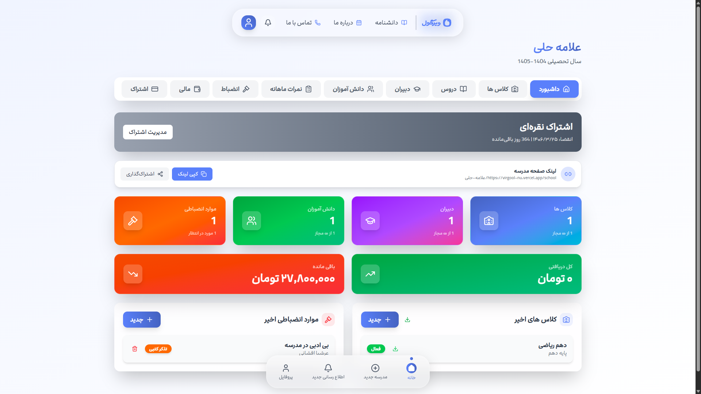
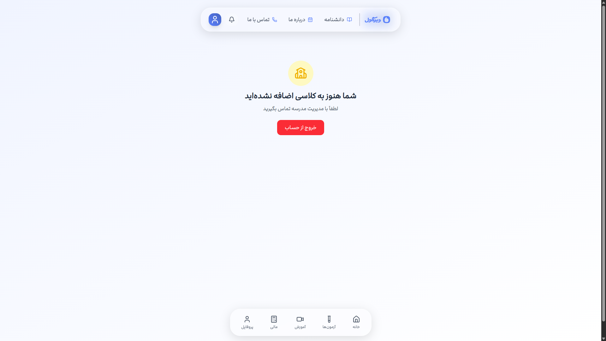
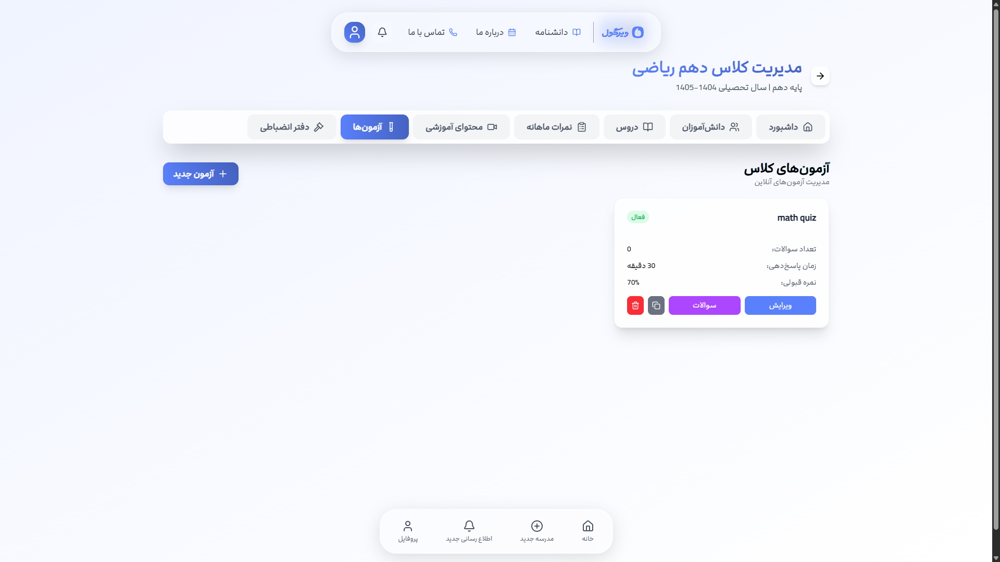
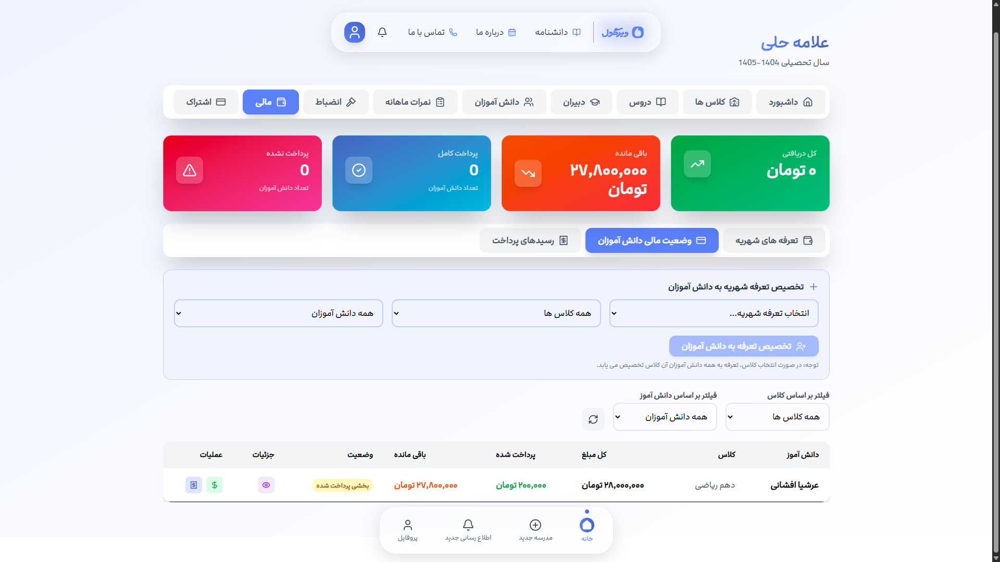

# Virgool - Smart School Management System


[](https://nextjs.org/)
[](https://reactjs.org/)
[](https://www.mongodb.com/)
[](https://tailwindcss.com/)
[](https://opensource.org/licenses/MIT)

**Virgool** is a comprehensive, production-ready school management system built with **Next.js 16**, **React 19**, **MongoDB**, and **Tailwind CSS**. It provides a modern, responsive, and feature-rich platform for educational institutions to manage students, classes, payments, exams, and communications digitally.

---

## Table of Contents

- [Features](#features)
- [Architecture](#architecture)
- [Tech Stack](#tech-stack)
- [Getting Started](#getting-started)
- [Project Structure](#project-structure)
- [API Reference](#api-reference)
- [Database Schema](#database-schema)
- [Deployment](#deployment)
- [Screenshots](#screenshots)
- [Contributing](#contributing)
- [License](#license)

---

## Features

### Core Modules

| Module | Description |
|--------|-------------|
| **Student Management** | Complete student profiles, enrollment tracking, and placement tests |
| **Class Scheduling** | Create, manage, and schedule classes with teacher assignments |
| **Payment System** | Digital payment processing, receipt generation, and financial reporting |
| **Online Exams** | Create quizzes with automatic grading, time limits, and attempt tracking |
| **Notification System** | In-app messaging, push notifications, and announcement broadcasting |
| **Score Tracking** | Grade management, report cards, and performance analytics |
| **Wallet System** | Digital wallet for students with transaction history |
| **Certificate Generation** | Automated PDF certificate creation with customizable templates |

### Advanced Features

- **Placement Tests**: Automated level assessment for new student enrollment
- **Real-time Dashboard**: Live statistics and analytics with interactive charts
- **Role-based Access Control**: Secure multi-role authentication (Admin, Teacher, Student)
- **Responsive Design**: Fully optimized for mobile, tablet, and desktop
- **Dark Mode Support**: Theme switching for enhanced user experience
- **PDF Export**: Generate professional reports, invoices, and certificates
- **Automated Cron Jobs**: Scheduled tasks for quiz expiration and maintenance

---

## Architecture

### System Overview

```
┌─────────────────────────────────────────────────────────────────┐
│                        CLIENT LAYER                             │
│  ┌─────────────┐  ┌─────────────┐  ┌─────────────┐            │
│  │   Student   │  │   Teacher   │  │    Admin    │            │
│  │    Portal   │  │   Portal    │  │   Portal    │            │
│  └──────┬──────┘  └──────┬──────┘  └──────┬──────┘            │
└─────────┼────────────────┼────────────────┼────────────────────┘
          │                │                │
┌─────────▼────────────────▼────────────────▼────────────────────┐
│                      NEXT.JS APP LAYER                         │
│  ┌────────────┐  ┌────────────┐  ┌────────────┐              │
│  │  API Routes │  │  Middleware │  │   Pages    │              │
│  │  (REST)     │  │  (JWT Auth)│  │  (SSR/CSR) │              │
│  └──────┬─────┘  └──────┬─────┘  └──────┬─────┘              │
└─────────┼───────────────┼───────────────┼──────────────────────┘
          │               │               │
┌─────────▼───────────────▼───────────────▼──────────────────────┐
│                      DATA LAYER                                │
│  ┌─────────────────────────────────────────────────────────┐   │
│  │                    MongoDB Atlas                         │   │
│  │  ┌─────────┐ ┌─────────┐ ┌─────────┐ ┌─────────┐     │   │
│  │  │ Students│ │ Classes │ │ Payments│ │  Quizzes │     │   │
│  │  └─────────┘ └─────────┘ └─────────┘ └─────────┘     │   │
│  └─────────────────────────────────────────────────────────┘   │
└─────────────────────────────────────────────────────────────────┘
```

### Authentication Flow

```
┌──────────┐     ┌──────────┐     ┌──────────┐     ┌──────────┐
│  Login   │────▶│  JWT     │────▶│  Middleware│────▶│ Protected │
│  Request │     │  Generate│     │  Validate │     │  Routes   │
└──────────┘     └──────────┘     └──────────┘     └──────────┘
```

---

## Tech Stack

### Frontend
| Technology | Purpose | Version |
|------------|---------|---------|
| **Next.js** | React framework with SSR/SSG | 16.2.9 |
| **React** | UI library | 19.1.0 |
| **Tailwind CSS** | Utility-first CSS framework | 4.0 |
| **Framer Motion** | Animation library | 12.23.24 |
| **Recharts** | Charting library | 3.3.0 |
| **Lucide React** | Icon library | 0.546.0 |

### Backend
| Technology | Purpose | Version |
|------------|---------|---------|
| **Next.js API Routes** | Serverless API endpoints | 16.2.9 |
| **MongoDB** | NoSQL database | 8.19.1 |
| **Mongoose** | MongoDB ODM | 8.19.1 |
| **jsonwebtoken** | JWT authentication | 9.0.2 |
| **bcryptjs** | Password hashing | 3.0.2 |

### Utilities
| Technology | Purpose |
|------------|---------|
| **jsPDF** | PDF generation |
| **html2canvas** | HTML to canvas conversion |
| **nextjs-toast-notify** | Toast notifications |
| **dotenv** | Environment variable management |

---

## Getting Started

### Prerequisites

- **Node.js** 18.0 or higher
- **npm** or **yarn** or **pnpm**
- **MongoDB** (local instance or MongoDB Atlas)

### Installation

1. **Clone the repository**

```bash
git clone https://github.com/yourusername/virgool.git
cd virgool
```

2. **Install dependencies**

```bash
npm install
# or
yarn install
# or
pnpm install
```

3. **Configure environment variables**

Create a `.env.local` file in the root directory:

```env
# MongoDB Connection
MONGODB_URI=mongodb://127.0.0.1:27017/virgool

# Application URL
NEXT_PUBLIC_BASE_URL=http://localhost:3000

# JWT Secret Key
JWT_SECRET=your-super-secret-jwt-key-here
```

4. **Start the development server**

```bash
npm run dev
# or
yarn dev
# or
pnpm dev
```

5. **Open your browser**

Navigate to [http://localhost:3000](http://localhost:3000)

### Production Build

```bash
# Build the application
npm run build

# Start the production server
npm run start
```

---

## Project Structure

```
virgool/
├── public/                    # Static assets
│   ├── fonts/                 # Custom fonts
│   ├── icons/                 # Application icons
│   └── posters/               # Promotional images
├── src/
│   ├── app/                   # Next.js App Router
│   │   ├── api/               # API routes
│   │   ├── about/             # About page
│   │   ├── call/              # Video call feature
│   │   ├── learning/          # Learning management
│   │   ├── login/             # Authentication
│   │   ├── mypanel/           # User dashboard
│   │   ├── new/               # New item creation
│   │   ├── notifications/     # Notification center
│   │   ├── panel/             # Admin panel
│   │   ├── pricing/           # Pricing plans
│   │   ├── profile/           # User profile
│   │   ├── quiz/              # Quiz system
│   │   ├── school/            # School management
│   │   ├── send-notification/ # Notification sender
│   │   ├── services/          # Service management
│   │   └── wallet/            # Digital wallet
│   ├── components/            # Reusable UI components
│   ├── config/                # Configuration files
│   ├── hooks/                 # Custom React hooks
│   ├── lib/                   # Utility libraries
│   ├── middleware.js          # Next.js middleware
│   └── models/                # Mongoose schemas
├── .env.local                 # Environment variables
├── .gitignore                 # Git ignore rules
├── eslint.config.mjs          # ESLint configuration
├── jsconfig.json              # JavaScript configuration
├── next.config.mjs            # Next.js configuration
├── package.json               # Dependencies
├── postcss.config.mjs         # PostCSS configuration
├── tsconfig.json              # TypeScript configuration
└── vercel.json                # Vercel deployment config
```

---

## API Reference

### Authentication Endpoints

| Method | Endpoint | Description |
|--------|----------|-------------|
| `POST` | `/api/auth/login` | User login |
| `POST` | `/api/auth/register` | User registration |
| `GET` | `/api/auth/me` | Get current user |

### Student Endpoints

| Method | Endpoint | Description |
|--------|----------|-------------|
| `GET` | `/api/students` | List all students |
| `GET` | `/api/students/[id]` | Get student by ID |
| `POST` | `/api/students` | Create new student |
| `PUT` | `/api/students/[id]` | Update student |
| `DELETE` | `/api/students/[id]` | Delete student |

### Class Endpoints

| Method | Endpoint | Description |
|--------|----------|-------------|
| `GET` | `/api/classes` | List all classes |
| `POST` | `/api/classes` | Create new class |
| `PUT` | `/api/classes/[id]` | Update class |
| `DELETE` | `/api/classes/[id]` | Delete class |

### Payment Endpoints

| Method | Endpoint | Description |
|--------|----------|-------------|
| `GET` | `/api/payments` | List all payments |
| `POST` | `/api/payments` | Record new payment |
| `GET` | `/api/payments/[id]` | Get payment details |
| `GET` | `/api/payments/receipt/[id]` | Generate receipt |

### Quiz Endpoints

| Method | Endpoint | Description |
|--------|----------|-------------|
| `GET` | `/api/quizzes` | List all quizzes |
| `POST` | `/api/quizzes` | Create new quiz |
| `POST` | `/api/quizzes/[id]/attempt` | Submit quiz attempt |
| `GET` | `/api/quizzes/[id]/results` | Get quiz results |

### Notification Endpoints

| Method | Endpoint | Description |
|--------|----------|-------------|
| `GET` | `/api/notifications` | List user notifications |
| `POST` | `/api/notifications` | Send new notification |
| `PUT` | `/api/notifications/[id]/read` | Mark as read |

---

## Database Schema

### User Model

```javascript
{
  _id: ObjectId,
  name: String,
  email: String,
  password: String, // Hashed with bcrypt
  role: "admin" | "teacher" | "student",
  phone: String,
  avatar: String,
  createdAt: Date,
  updatedAt: Date
}
```

### Student Model

```javascript
{
  _id: ObjectId,
  userId: ObjectId, // Reference to User
  studentId: String, // Unique student ID
  level: String,
  enrolledClasses: [ObjectId],
  payments: [ObjectId],
  scores: [ObjectId],
  createdAt: Date,
  updatedAt: Date
}
```

### Class Model

```javascript
{
  _id: ObjectId,
  name: String,
  subject: ObjectId, // Reference to Subject
  teacher: ObjectId, // Reference to User
  schedule: {
    days: [String],
    startTime: String,
    endTime: String
  },
  capacity: Number,
  enrolledStudents: [ObjectId],
  createdAt: Date,
  updatedAt: Date
}
```

### Payment Model

```javascript
{
  _id: ObjectId,
  student: ObjectId,
  amount: Number,
  method: "cash" | "card" | "online",
  status: "pending" | "completed" | "failed",
  receipt: String,
  createdAt: Date,
  updatedAt: Date
}
```

---

## Deployment

### Vercel (Recommended)

1. Push your code to GitHub
2. Import the project on [Vercel](https://vercel.com)
3. Configure environment variables
4. Deploy!

### Manual Deployment

```bash
# Build the application
npm run build

# Start the production server
npm run start
```

### Environment Variables for Production

```env
MONGODB_URI=mongodb+srv://<username>:<password>@cluster.mongodb.net/virgool
NEXT_PUBLIC_BASE_URL=https://yourdomain.com
JWT_SECRET=your-production-jwt-secret
```

---

## Screenshots

### Home Page


### Dashboard


### Student Management


### Online Quiz


### Payment System


---

## Contributing

Contributions are welcome! Please follow these steps:

1. Fork the repository
2. Create your feature branch (`git checkout -b feature/amazing-feature`)
3. Commit your changes (`git commit -m 'Add amazing feature'`)
4. Push to the branch (`git push origin feature/amazing-feature`)
5. Open a Pull Request

### Code Style

- Follow ESLint configuration
- Use meaningful variable and function names
- Write comments for complex logic
- Keep components small and focused

---

## License

This project is licensed under the Apache 2.0 License - see the [LICENSE](LICENSE) file for details.

---

## Support

For support, email appmaker.allvo@gmail.com or open an issue on GitHub.

---

**Built with ❤️ using Next.js, React, and MongoDB by virgool team**

---
